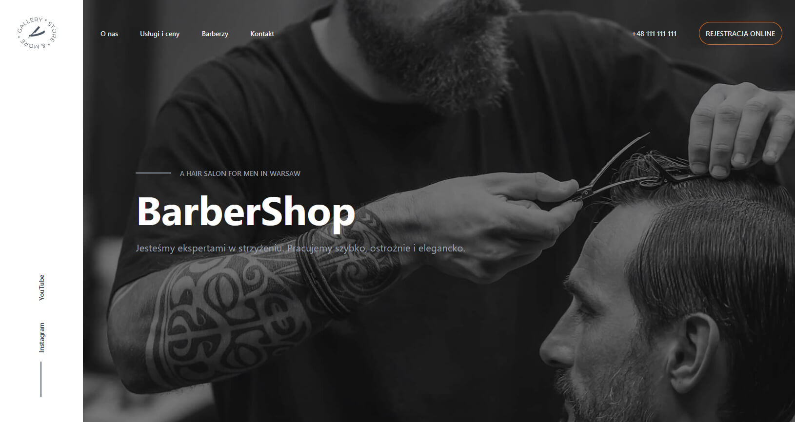
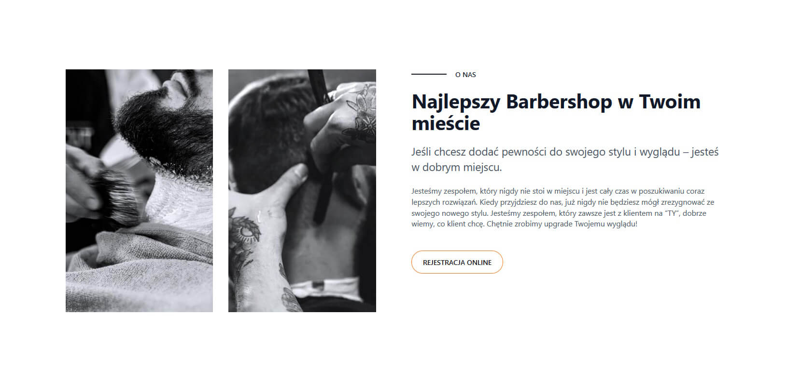
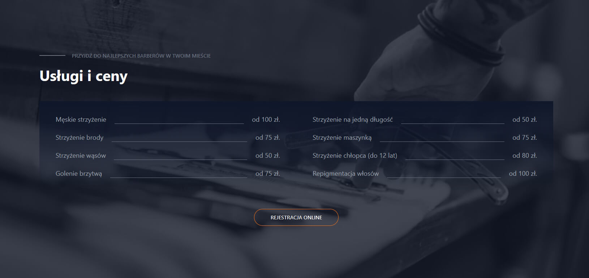
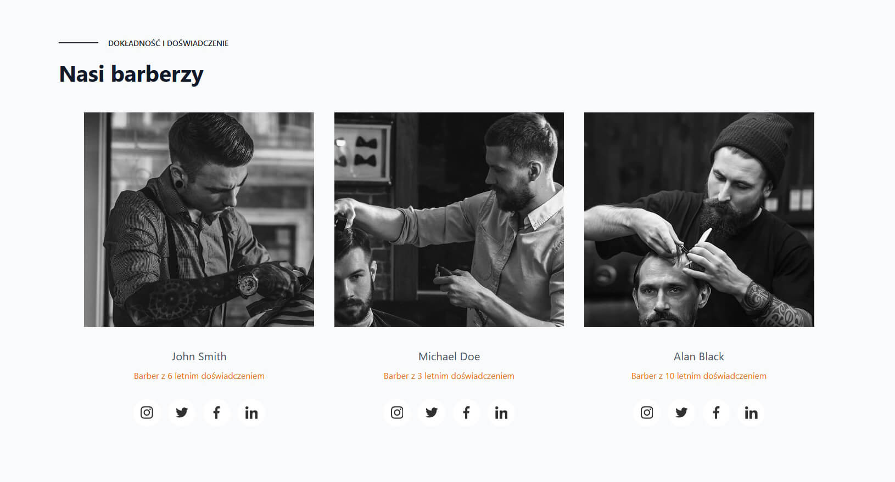
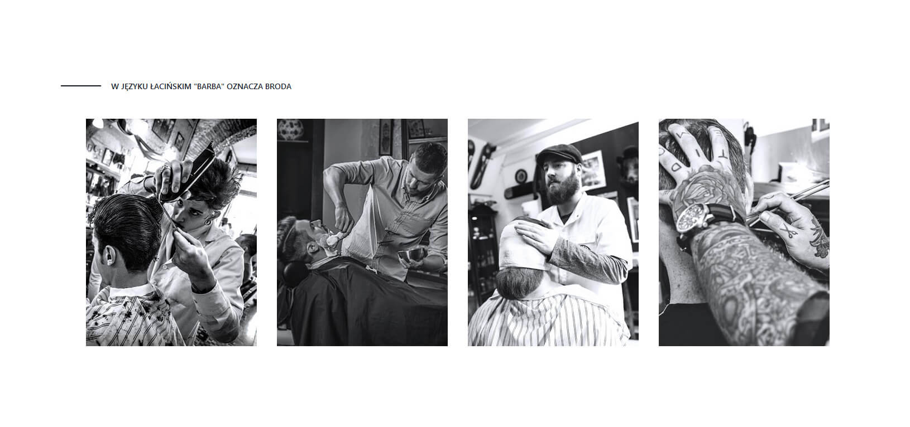
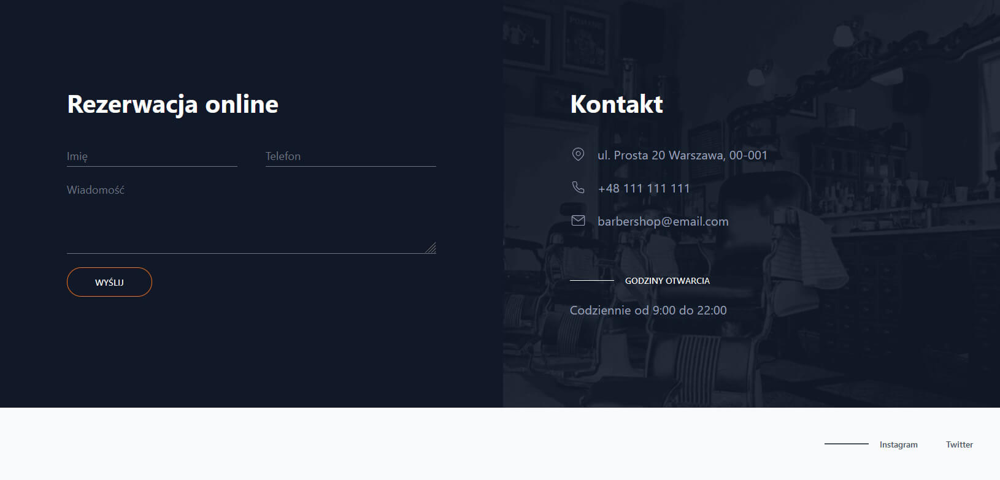

# Website for another non-existent company

This project is a simple HTML-based website for a barber shop. While the HTML itself was straightforward, the real learning experience came from getting acquainted with Tailwind CSS. Most of my time was spent adjusting to this new workflow, which was a significant shift from my usual methods.

Additionally, this project marks the first time I have incorporated TypeScript into my work. This added an extra layer of complexity and learning, but ultimately, it was a rewarding challenge. 🚀

## Demo

🔗 [Finished website](https://dag-szad.github.io/BarberShop/)
## Tech Stack

🔨 **HTML**, **CSS** with **TailwindCSS** and a little bit of **TypeScript**.

## Screenshots

## Roadmap

##### Done:

- ✅ **Responsive Homepage** - The homepage is now responsive for consistent experience across devices.
- ✅ **TypeScript Implementation** - Simple script coded with TypeScript has been integrated into the design to increase interactivity and functionality.
- ✅ **Optimized Images** - Images have been optimized for web performance, reducing loading times and overall site speed.

##### To Do:

- ❌ **Form Handling** - Implement form functionality to enable user interaction and data submission.

## Authors

- Dag
    - [Linkedin](https://www.linkedin.com/in/dagmara-szadkowska-708423255)
    - [GitHub](https://www.github.com/dag-szad)

## Feedback

If you have any feedback, comments, tips, please reach out to me at LinkedIn. 🤗